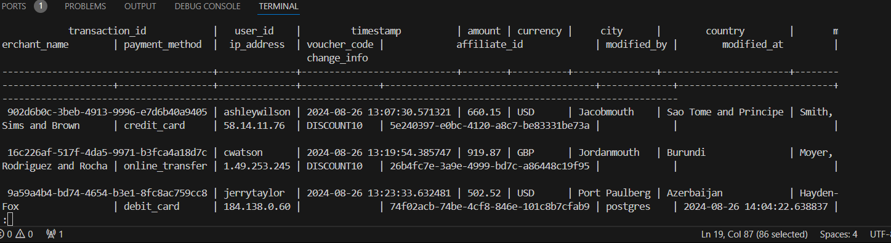

# Dockerized PostgreSQL with Debezium for Change Data Capture (CDC)

## Overview
This repository provides a Docker Compose setup for running a PostgreSQL database with a Debezium connector. The setup enables capturing and streaming changes made to the PostgreSQL database to a Kafka topic.

## Prerequisites
- **Docker:** [Install Docker](https://www.docker.com/)
- **Docker Compose:** [Install Docker Compose](https://docs.docker.com/compose/install/)

## Getting Started

### 1. Clone the Repository
```bash
git clone https://github.com/sdshah09/Real-time-Database-Change-Monitoring-System.git
```
### 2. Start the services
```bash
docker-compose up -d
```
- This command will start all the services defined in the docker-compose.yml file.

### 3.Check Running Containers

```bash
docker ps
``` 
### 4. Stopping the Services
```bash
docker compose down
```

### 5. View Docker images
```bash
docker images
```

## Services in the Setup

### 1. Zookeeper
Zookeeper is used for managing and coordinating the Kafka brokers in the setup.

### 2. Kafka Broker
Kafka broker is the core of the setup, where Debezium streams the changes made in PostgreSQL.

### 3. Debezium
Debezium is a CDC tool that captures changes in the PostgreSQL database and streams them to Kafka topics.

### 4. PostgreSQL
The PostgreSQL database, named `financial_db`, contains the `transactions` table which will be monitored for changes.

### 5. Entering the PostgreSQL Container
To access the PostgreSQL container:

```bash
docker exec -it postgres /bin/bash
```
### 6. Checking Data in PostgreSQL
To view the data inside the `transactions` table:

```sql
SELECT * FROM transactions;
```
### 7. Update `transactions` Table
To update a record in the `transactions` table:

```sql
UPDATE transactions SET amount = amount + 100 WHERE transaction_id = 'transaction_id';
```
### 8. Configure Debezium Connector
To create a PostgreSQL connector in Debezium, run the following command inside the Debezium container:
```bash
curl -H 'Content-Type: application/json' -X PUT localhost:8083/connectors/postgres-fin-connector/config --data '{
  "connector.class": "io.debezium.connector.postgresql.PostgresConnector",
  "topic.prefix": "cdc",
  "decimal.handling.mode": "double",
  "database.user": "postgres",
  "database.dbname": "financial_db",
  "database.hostname": "postgres",
  "database.password": "******",
  "plugin.name": "pgoutput"
}'
```

## Advanced PostgreSQL Configuration

### 1. Alter Table for Full Replica Identity

To track before and after values of updates:

```sql
ALTER TABLE transactions REPLICA IDENTITY FULL;
```
### 2. Adding Audit Columns
Add columns to track who modified a record and when:
```sql
ALTER TABLE transactions ADD COLUMN modified_by TEXT;
ALTER TABLE transactions ADD COLUMN modified_at TIMESTAMP;
```

### 3. Create Trigger for Audit Information
Create a trigger function to automatically populate modified_by and modified_at columns:

```sql
CREATE OR REPLACE FUNCTION record_change_user()
RETURNS TRIGGER AS $$
BEGIN
    NEW.modified_by := current_user;
    NEW.modified_at := CURRENT_TIMESTAMP;
    RETURN NEW;
END;
$$ LANGUAGE plpgsql;
```

### 4. Track Changed Columns
Add a change_info JSONB column to store details about changed columns:
```sql
ALTER TABLE transactions ADD COLUMN change_info JSONB;
```

Create a trigger to update this column on changes:
```sql
CREATE OR REPLACE FUNCTION record_changed_columns()
RETURNS TRIGGER AS $$
DECLARE
    change_details JSONB;
BEGIN
    change_details := '{}'::JSONB; -- Initialize an empty JSON object

    -- Check if the amount has changed
    IF NEW.amount IS DISTINCT FROM OLD.amount THEN
        change_details := jsonb_insert(
            change_details,
            '{amount}',
            jsonb_build_object(
                'old', OLD.amount,
                'new', NEW.amount,
                'modified_by', current_user,
                'modified_at', NOW()
            )
        );
    END IF;

    -- Update the change_info column with the change details
    NEW.change_info := change_details;

    RETURN NEW;
END;
$$ LANGUAGE plpgsql;
```
Finally, create a trigger that executes the function on updates:
```sql
CREATE TRIGGER trigger_record_change_info
BEFORE UPDATE ON transactions
FOR EACH ROW EXECUTE FUNCTION record_changed_columns();
```

